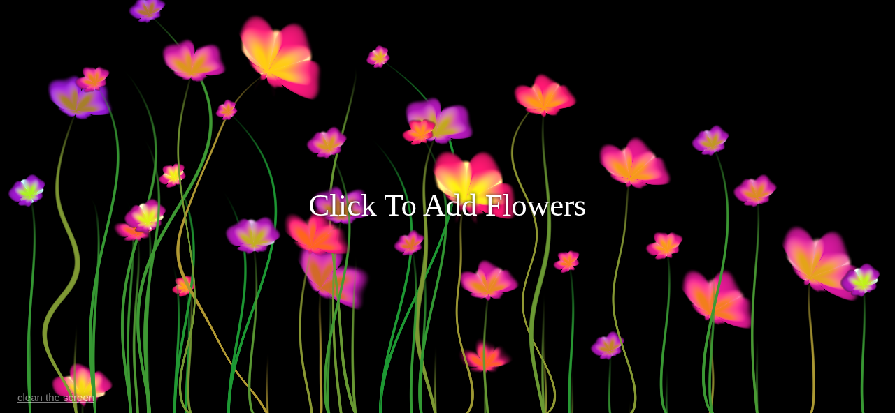

# 🌸 Interactive Flower Shader — Three.js + GLSL  
Beautiful procedural flower animations generated completely using WebGL shader techniques.  
Flowers bloom wherever you click, created using pure math inside a custom GLSL fragment shader..

---

## 🎬 Live Demo  
https://nerdonyorks.github.io/Flower/

---

## 🌼 Overview  
This project generates **animated procedural flowers** on every click.  
Each flower is drawn using:

- 🌿 **Procedural stems**  
- 🌸 **Petal generation using sine functions & noise**  
- 🌈 **Randomized colors & shapes**  
- 💫 **Smooth animated growth**  

Powered entirely by **GLSL + Three.js**, not images.

The background uses a **WebGL RenderTarget ping-pong system** to accumulate drawings smoothly, allowing flowers to remain on screen until cleared.

---

## 🖼 Screenshot  

  

## ✨ Features  

- 🌸 Click to grow dynamic flowers  
- 🌿 Procedural stems + petals using math  
- 🎨 Randomized flower colors & shapes  
- 🔄 Smooth blending using WebGL RenderTarget ping-pong  
- 🧽 One-click “Clean Screen” reset  
- 📱 Full touch-screen support  
- 💻 Responsive canvas  

---
🚀 Running the Project Locally

Shaders & ES modules require a local server.

**Option A — VS Code Live Server**

  Click Go Live.

**Option B — Python server**
    => python3 -m http.server
  Then open:
    => http://localhost:8000/

